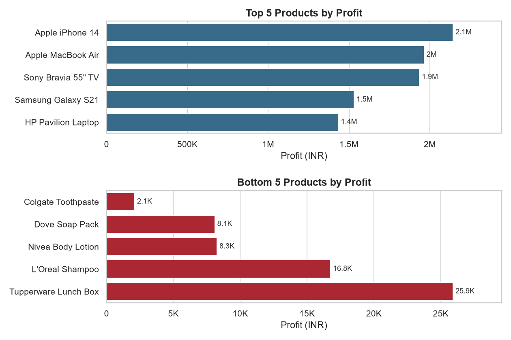
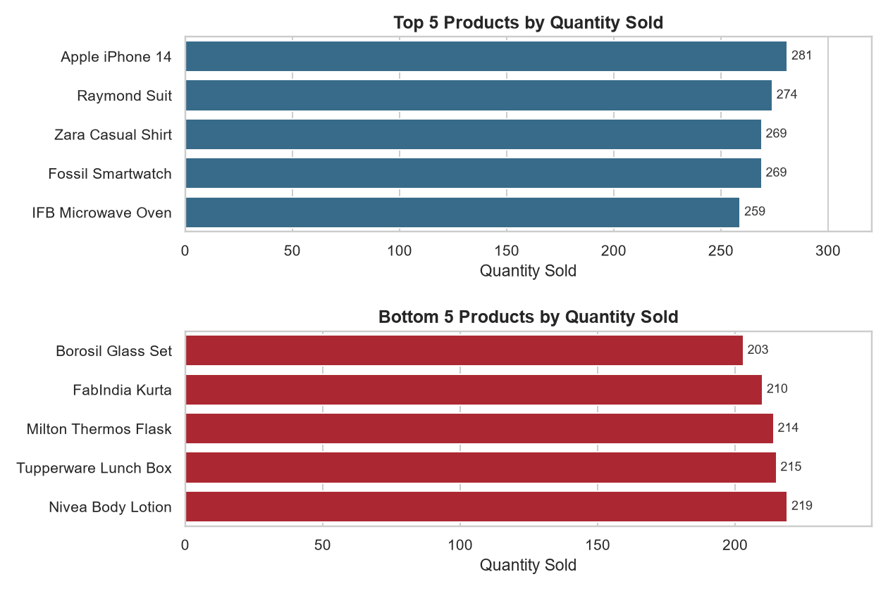
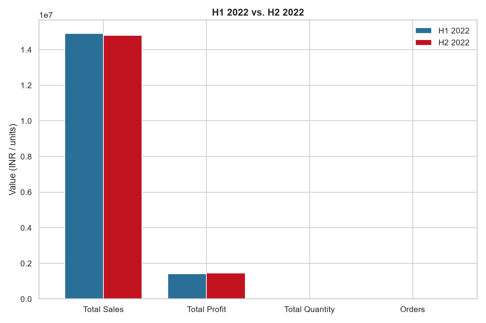
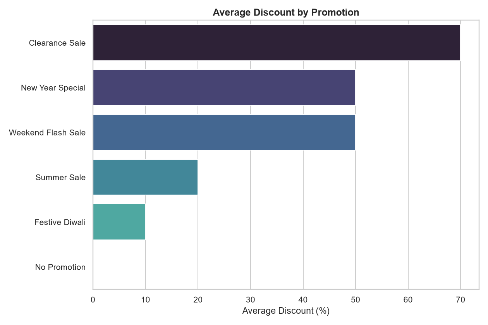

# Sales Data Analysis

Retail sales analysis answering a set of core business questions about sales,
profit, discounts, and customer geography — implemented **twice**, side by
side, on the same star-schema dataset:

- **Power BI** (`powerbi/`) — the original dashboard: a `.pbix` file with the
  data model, DAX measures and interactive visuals.
- **Python** (`src/` + `notebooks/`) — a modular, testable reimplementation of
  the same analysis using pandas / matplotlib / seaborn.

Both implementations read the exact same workbook (`data/store_data.xlsx`),
so results can be cross-checked between the two.

## Project Structure

```
sales-data-analysis/
├── README.md
├── requirements.txt
├── .gitignore
├── data/
│   └── store_data.xlsx            # raw source workbook (fact + 3 dimension tables)
├── src/                            # reusable Python analysis package
│   ├── data_loader.py              # reads the raw Excel sheets
│   ├── data_cleaning.py            # whitespace / dtype cleanup
│   ├── feature_engineering.py      # fills any missing derived columns + builds the master table
│   ├── analysis.py                 # one function per business question
│   └── visualization.py            # one chart function per business question
├── notebooks/
│   └── Sales_Data_Analysis.ipynb   # end-to-end Python analysis, calls into src/
├── screenshots/                    # exported chart images from the notebook (auto-generated)
│   ├── 01_top_bottom_sales.png
│   ├── 02_sales_trends.png
│   └── ...
└── powerbi/                        # Power BI implementation
    ├── Sales_Data_Analysis.pbix    # the Power BI report file
    ├── data-model.png              # relationships view (Fact + 3 Dim tables)
    └── screenshots/                # exported dashboard / visual screenshots
        ├── 01_top_bottom_products.png
        ├── 02_sales_trends.png
        └── ...
```

> Put your `.pbix` file and its exported visuals under `powerbi/` exactly as
> above — that's the one folder a visitor needs to check to see the Power BI
> side of the project. `powerbi/screenshots/` mirrors the numbering used in
> `screenshots/` (`01_...`, `02_...`) so the two implementations are easy to
> compare question-by-question in the **Results** section below.

## Dataset

`data/store_data.xlsx` is a star schema with one fact table and three
dimension tables:

| Sheet | Role | Key columns |
|---|---|---|
| `Sheet3` | Fact table | Date, CustomerID, PromotionID, Product ID, Units Sold, Price Per Unit, Total Sales, Discount Percentage, Discount, Net Sales, **Profit** |
| `Dim Customers` | Dimension | Customer ID, Customer Name, City, State, Pincode, EmailID, Phone Number |
| `Dim Product` | Dimension | ProductID, Product Name, Product Line, Price Per Unit (INR) |
| `Dim Promotion` | Dimension | PromotionID, Promotion Name, Ad Type, Coupon Code, Price Reduction Type, **Percentage** |

`Fact` relates to `Dim Product` and `Dim Promotion` many-to-one, and to
`Dim Customers` many-to-one, matching the relationships view in Power BI
(`powerbi/data-model.png`).

The fact table's derived columns (`Price Per Unit`, `Total Sales`,
`Discount Percentage`, `Discount`, `Net Sales`, `Profit`) are expected to
already be populated in the current workbook. `src/feature_engineering.py`
still knows how to compute every one of them from the dimension tables, but
now only fills in a value where it's actually missing — so the pipeline works
unchanged whether you're using a fully-populated workbook or an older one
that ships those columns blank. See that module's docstring for the exact
assumptions (e.g. the discount % is read from `Dim Promotion["Percentage"]`
when present, otherwise parsed from `"Price Reduction Type"`; `Profit` falls
back to a flat 10% margin on Net Sales only when it isn't supplied directly).

## Business Questions

| # | Question |
|---|---|
| Q1 | Top / Bottom 5 products by Sales, Profit and Quantity Sold |
| Q2 | How do sales trends vary over time (daily, monthly, quarterly, yearly)? |
| Q3 | What is the relationship between Sales and Profit? |
| Q4 | Compare Sales / Profit / Quantity Sold between any two user-selected periods |
| Q5 | Average discount offered in each discount category |
| Q6 | Total number of orders |
| Q7 | Sales / Profit / Discount / Net Sales / all fields for each order, filterable by Product / Date / Customer ID / Promotion |
| Q8 | Sales by different cities |

## Setup

### Python

```bash
git clone <repo-url>
cd sales-data-analysis
python -m venv .venv && source .venv/bin/activate   # optional but recommended
pip install -r requirements.txt
jupyter notebook notebooks/Sales_Data_Analysis.ipynb
```

### Power BI

Open `powerbi/Sales_Data_Analysis.pbix` in Power BI Desktop. It points at the
same `data/store_data.xlsx` workbook — update the data source path (Transform
Data → Data source settings) if you've cloned the repo somewhere other than
its original location.

## Results

Each question below is shown from both implementations so they can be
compared directly.

### Q1 — Top / Bottom 5 Products by Sales
| Python | Power BI |
|---|---|
|  |  |

### Q1 — Top / Bottom 5 Products by Profit
| Python | Power BI |
|---|---|
|  |  |

### Q1 — Top / Bottom 5 Products by Quantity Sold
| Python | Power BI |
|---|---|
|  |  |

### Q2 — Sales Trends Over Time
| Python | Power BI |
|---|---|
|  |  |

### Q3 — Sales vs. Profit Relationship
| Python | Power BI |
|---|---|
|  |  |

### Q4 — Period-over-Period Comparison (example: H1 2022 vs H2 2022)
| Python | Power BI |
|---|---|
|  |  |

### Q5 — Average Discount by Promotion Category
| Python | Power BI |
|---|---|
|  |  |

### Q8 — Sales by City
| Python | Power BI |
|---|---|
|  |  |

> Q6 (total order count) and Q7 (filterable order-level table) are
> computational outputs / interactive tables rather than static charts — see
> the notebook for the Python side and the report's table visual + slicers
> for the Power BI side.

## Tech Stack

- **Power BI Desktop** — data model, DAX measures, interactive dashboard
- **pandas / numpy** — data cleaning, feature engineering, aggregation
- **matplotlib / seaborn** — visualization
- **Jupyter** — analysis notebook

## Notes & Assumptions

- `PromotionID = 0` in the fact table is treated as "no promotion applied".
- The promotion `"Buy 1 Get 1 Free"` is modeled as an effective 50% discount.
- `Discount %` is read from `Dim Promotion["Percentage"]` when that column is
  present; otherwise it's parsed from the `"Price Reduction Type"` text.
- `Profit` is normally supplied directly in the fact table. Where it's
  missing, it's estimated as a flat 10% of Net Sales — swap in real cost data
  in `src/feature_engineering.py` if available.
- Both implementations share one source workbook (`data/store_data.xlsx`);
  keep it in sync in one place rather than maintaining separate copies for
  Python and Power BI.
