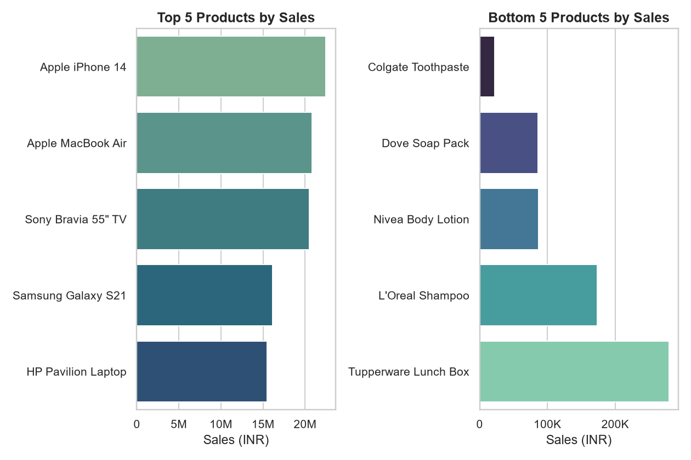
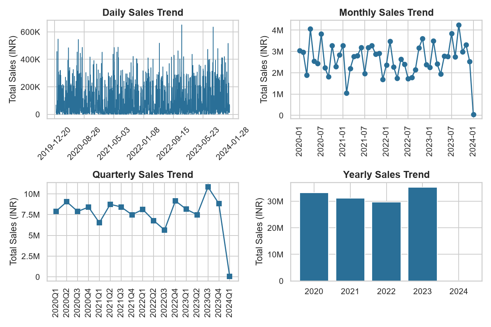
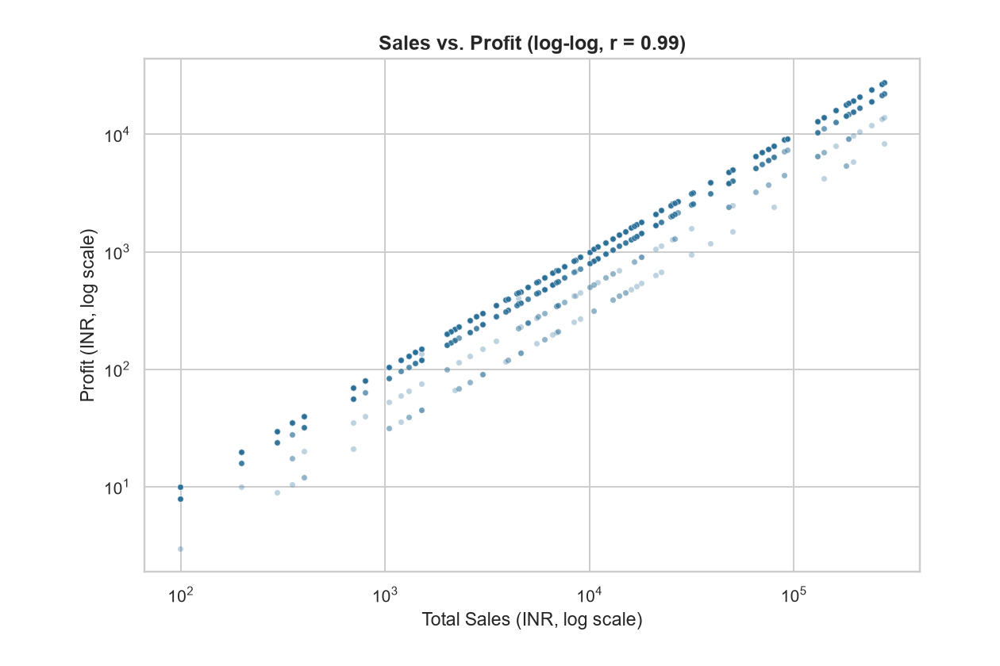
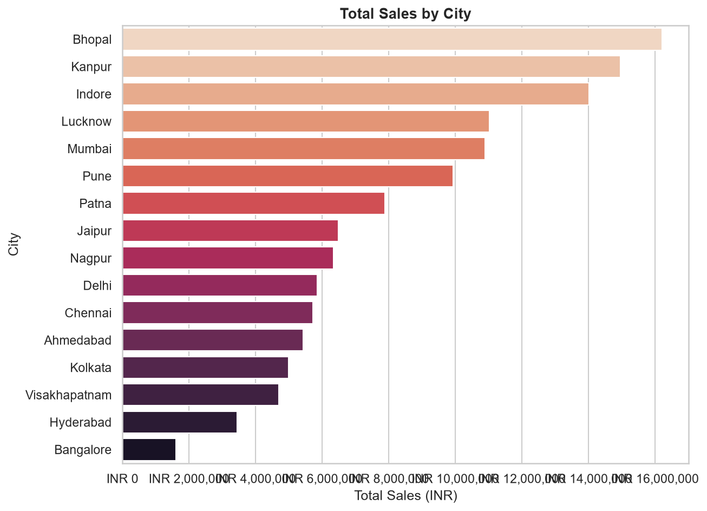
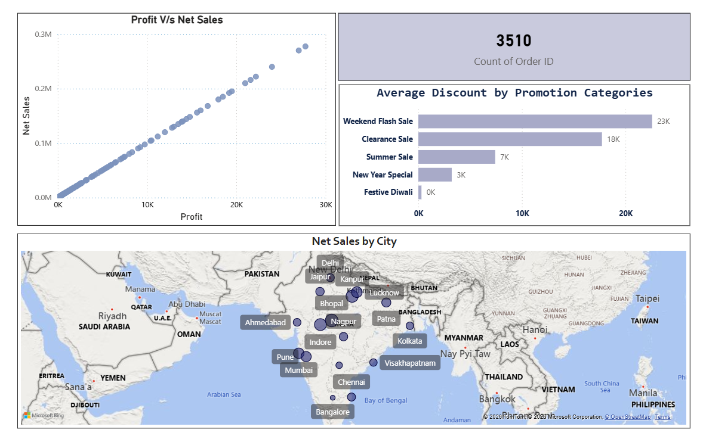

# 📊 Sales Data Analysis

A retail sales dataset, analyzed twice: first exploratively in **Python**, question by question, then packaged into an interactive **Power BI** dashboard so anyone on the business side can explore it without touching code.

---

## Part 1 — Exploring the data in Python

The analysis started with one question and let each answer point to the next.

**Which products actually drive the business?**
Grouping every order by product and ranking on sales revealed a steep drop-off — a handful of electronics carry most of the revenue, while the bottom performers barely register.

<p align="center"></p>

**Is revenue steady, or seasonal?**
Rolling the same sales figures up by day, month, quarter, and year showed a clear pattern: a mid-year dip and a strong Q4 close, repeating across years.

<p align="center"></p>

**Can the profit numbers be trusted?**
Since the raw data has no cost column, profit had to be estimated. Plotting profit against sales before locking in that assumption showed an almost perfectly straight line (r ≈ 0.99) — confirmation that a flat margin on net sales is a safe, consistent estimate rather than a rough guess.

<p align="center"></p>

**Where is this revenue coming from?**
Aggregating sales by customer city surfaced a small cluster of metro cities generating a disproportionate share of revenue — useful for targeting future promotions.

<p align="center"></p>

Every step above is a function in [`src/`](src) — `analysis.py` returns the numbers, `visualization.py` renders the chart — so the whole notebook re-runs end-to-end on fresh data with no manual steps. The remaining questions (average discount by promotion, period-over-period comparison) are covered the same way — see [`screenshots/`](screenshots) and the notebook for the full set.

---

## Part 2 — Turning it into a Power BI dashboard

The Python notebook answers each question once. The dashboard makes those same questions explorable — filter by date, product, customer, or promotion, and every visual updates together.

**A single-page control tower.** Total orders, net sales vs. profit, average discount by promotion, and a live map of sales by city, all filterable at once.

<p align="center"></p>

**Compare any two periods side by side** — sales, profit, and quantity sold, each with its own independent date range slicer.

<p align="center"></p>

**Drill into every single order** — filterable by product, customer, date, or promotion, down to the transaction level.

<p align="center"></p>

**Do the top sellers also make the most money?** Ranking products by both sales and profit side by side confirms it — the same five products lead on both metrics, since profit is a fixed margin of sales. The bottom performers tell a different story: mostly low-ticket household items where even strong unit sales barely move the needle on revenue.

<p align="center"></p>

Open `powerbi/sales-data-analysis.pbix` in Power BI Desktop for the full interactive report, including the top/bottom product breakdowns and cross-visual filtering.

---

## Tech stack

**Python** — pandas, numpy, matplotlib, seaborn, Jupyter
**Power BI** — DAX measures, slicers, drill-through, interactive filtering

## Project structure

```
sales-data-analysis/
├── data/store_data.xlsx          # source workbook (fact + 3 dimension tables)
├── powerbi/
│   ├── sales-data-analysis.pbix  # interactive dashboard
│   └── *.PNG                     # dashboard screenshots
├── src/                          # analysis package
│   ├── data_loader.py            # reads the raw Excel sheets
│   ├── data_cleaning.py          # whitespace / dtype cleanup
│   ├── feature_engineering.py    # derives price, discount, profit, net sales
│   ├── analysis.py               # one function per business question
│   └── visualization.py          # matching chart for each question
├── notebooks/Sales_Data_Analysis.ipynb
└── screenshots/                  # chart images exported by the notebook
```

## Quick start

```bash
git clone <repo-url>
cd sales-data-analysis
python -m venv .venv && source .venv/bin/activate
pip install -r requirements.txt
jupyter notebook notebooks/Sales_Data_Analysis.ipynb
```

## Key assumptions

- Discount rate is parsed from each promotion's terms (e.g. "20% off" → 20%); "Buy 1 Get 1 Free" is modeled as an effective 50% discount.
- Profit is calculated as a flat 10% margin on net sales, matching the measure used in the Power BI model (the source data has no cost column).
- Orders with no promotion applied are labeled "No Promotion."
