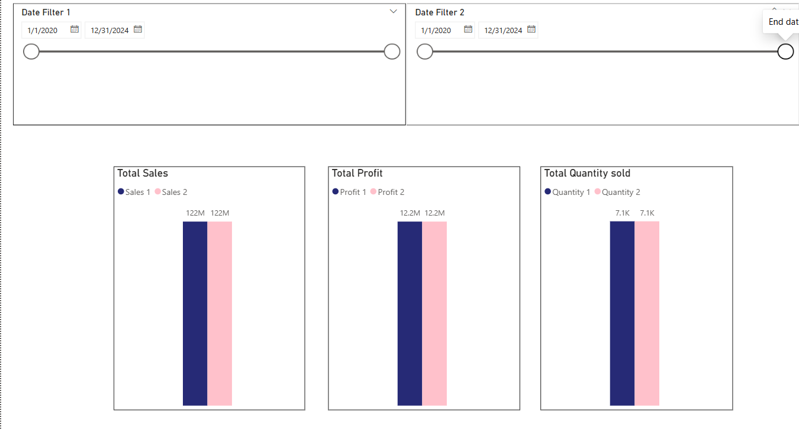
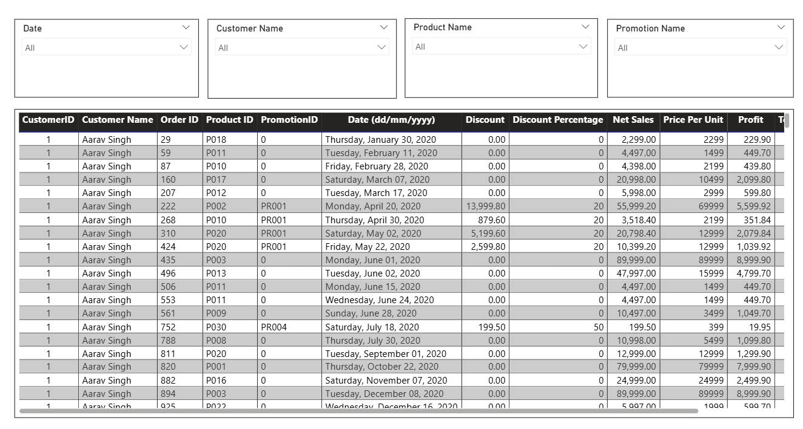
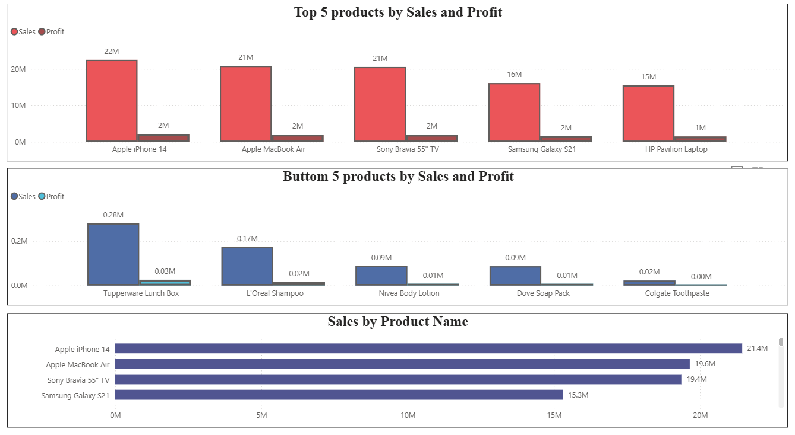

# 📊 Sales Data Analysis

[](https://github.com/panteamkhh/sales-data-analysis/actions/workflows/ci.yml)
[](LICENSE)
[](https://www.python.org/downloads/)
[](https://github.com/psf/black)

A retail sales dataset, analyzed twice: first exploratively in **Python**, question by question, then packaged into an interactive **Power BI** dashboard so anyone on the business side can explore it without touching code.

## Table of contents

- [Dataset](#dataset)
- [Part 1 — Exploring the data in Python](#part-1--exploring-the-data-in-python)
- [Part 2 — Turning it into a Power BI dashboard](#part-2--turning-it-into-a-power-bi-dashboard)
- [Key results](#key-results)
- [Tech stack](#tech-stack)
- [Project structure](#project-structure)
- [Quick start](#quick-start)
- [Development](#development)
- [Key assumptions](#key-assumptions)
- [License](#license)

## Dataset

`data/store_data.xlsx` is a **synthetic sample** retail workbook used for
demonstration. It contains one fact table (3,510 orders) and three dimension
tables (customers, products, promotions):

| Sheet          | Rows | Description                                   |
| -------------- | ---- | --------------------------------------------- |
| `Sheet3`       | 3510 | Fact table — date, customer, product, units   |
| `Dim Customers`| 50   | Customer name, city, state, contact fields    |
| `Dim Product`  | 30   | Product name, line, price (INR)               |
| `Dim Promotion`| 5    | Promotion name and discount terms             |

> The customer email/phone columns are illustrative placeholders, not real
> people. Treat them as dummy data.

---

## Part 1 — Exploring the data in Python

The analysis started with one question and let each answer point to the next.

**Which products actually drive the business?**
Grouping every order by product and ranking on sales revealed a steep drop-off — a handful of electronics carry most of the revenue, while the bottom performers barely register.

<p align="center"></p>

**Is revenue steady, or seasonal?**
Rolling the same sales figures up by day, month, quarter, and year showed a clear pattern: a mid-year dip and a strong Q4 close, repeating across years.

<p align="center"></p>

**Can the profit numbers be trusted?**
Since the raw data has no cost column, profit had to be estimated. Plotting profit against sales before locking in that assumption showed an almost perfectly straight line (r ≈ 0.99) — confirmation that a flat margin on net sales is a safe, consistent estimate rather than a rough guess.

<p align="center"></p>

**Where is this revenue coming from?**
Aggregating sales by customer city surfaced a small cluster of metro cities generating a disproportionate share of revenue — useful for targeting future promotions.

<p align="center"></p>

Every step above is a function in [`src/`](src) — `analysis.py` returns the numbers, `visualization.py` renders the chart — so the whole notebook re-runs end-to-end on fresh data with no manual steps. The remaining questions (average discount by promotion, period-over-period comparison) are covered the same way — see [`screenshots/`](screenshots) and the notebook for the full set.

---

## Part 2 — Turning it into a Power BI dashboard

The Python notebook answers each question once. The dashboard makes those same questions explorable — filter by date, product, customer, or promotion, and every visual updates together.

**A single-page control tower.** Total orders, net sales vs. profit, average discount by promotion, and a live map of sales by city, all filterable at once.

<p align="center"></p>

**Compare any two periods side by side** — sales, profit, and quantity sold, each with its own independent date range slicer.

<p align="center"></p>

**Drill into every single order** — filterable by product, customer, date, or promotion, down to the transaction level.

<p align="center"></p>

**Do the top sellers also make the most money?** Ranking products by both sales and profit side by side confirms it — the same five products lead on both metrics, since profit is a fixed margin of sales. The bottom performers tell a different story: mostly low-ticket household items where even strong unit sales barely move the needle on revenue.

<p align="center"></p>

Open `powerbi/sales-data-analysis.pbix` in Power BI Desktop for the full interactive report, including the top/bottom product breakdowns and cross-visual filtering. The underlying model and DAX measures are documented in [`powerbi/dax_measures.md`](powerbi/dax_measures.md).

---

## Key results

- **3,510 orders** across 30 products and 50 customers.
- Sales and profit move together almost perfectly (**Pearson r = 0.988**), which
  validates the flat-margin profit estimate.
- Revenue shows a repeating **mid-year dip and Q4 peak** across years.
- A small number of cities account for a disproportionate share of sales.

## Tech stack

**Python** — pandas, numpy, matplotlib, seaborn, Jupyter
**Power BI** — DAX measures, slicers, drill-through, interactive filtering
**Tooling** — pytest, ruff, black, GitHub Actions, pre-commit

## Project structure

```
sales-data-analysis/
├── data/
│   └── store_data.xlsx           # source workbook (fact + 3 dimension tables)
├── powerbi/
│   ├── sales-data-analysis.pbix  # interactive dashboard
│   ├── dax_measures.md           # documented measures and model
│   ├── data-model.png            # star-schema diagram
│   └── screenshots/              # dashboard screenshots
├── src/                          # analysis package
│   ├── config.py                 # project paths and constants
│   ├── data_loader.py            # reads + validates the raw Excel sheets
│   ├── data_cleaning.py          # whitespace / dtype cleanup
│   ├── feature_engineering.py    # derives price, discount, profit, net sales
│   ├── analysis.py               # one function per business question
│   ├── visualization.py          # matching chart for each question
│   └── run_analysis.py           # end-to-end CLI entry point
├── tests/                        # pytest suite
├── notebooks/Sales_Data_Analysis.ipynb
├── screenshots/                  # chart images exported by the notebook/CLI
├── pyproject.toml                # metadata, deps, tool config
├── requirements.txt              # runtime dependencies
├── requirements-dev.txt          # runtime + dev dependencies
└── .github/workflows/ci.yml      # lint + test CI
```

## Quick start

```bash
git clone https://github.com/panteamkhh/sales-data-analysis.git
cd sales-data-analysis

python -m venv .venv
# Windows (PowerShell)
.\.venv\Scripts\Activate.ps1
# macOS / Linux
source .venv/bin/activate

pip install -r requirements.txt
```

Run the full analysis and regenerate every chart:

```bash
python -m src.run_analysis
```

Or explore interactively:

```bash
pip install -r requirements-dev.txt
jupyter notebook notebooks/Sales_Data_Analysis.ipynb
```

## Development

```bash
pip install -e ".[dev]"   # or: pip install -r requirements-dev.txt

ruff check .              # lint
black --check .           # formatting
pytest                    # tests
pre-commit install        # optional git hooks
```

CI runs lint, format checks, and the test suite on Python 3.10–3.12. See
[`CONTRIBUTING.md`](CONTRIBUTING.md) for details.

## Key assumptions

- Discount rate is parsed from each promotion's terms (e.g. "20% off" → 20%); "Buy 1 Get 1 Free" is modeled as an effective 50% discount. Unrecognized terms raise a warning instead of failing silently.
- Profit is calculated as a flat 10% margin on net sales, matching the measure used in the Power BI model (the source data has no cost column).
- Orders with no promotion applied are labeled "No Promotion."

## License

Released under the [MIT License](LICENSE).
